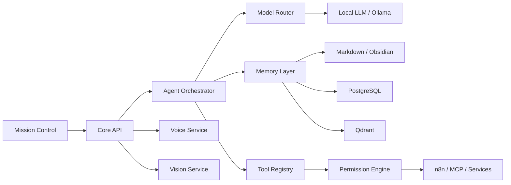

# Mina

> **Public project showcase.** Mina's implementation remains private because it contains personal automation logic, local infrastructure and integration details.

## Overview

**Mina** is a **local-first intelligent personal assistant** designed as a persistent cognitive workspace rather than a conventional chatbot.

It combines local AI, multi-layer memory, specialized agents, retrieval-augmented generation, automation, controlled tool execution, voice, vision and an interactive Mission Control interface.

## Core Principles

- **Local-first** — core functionality can operate locally
- **Persistent memory** — information survives individual chat sessions
- **Modular agents** — specialized capabilities behind an orchestrator
- **Auditable tools** — actions pass through explicit permissions
- **Graceful degradation** — optional infrastructure can fail without collapsing the whole system
- **Privacy-aware design** — personal data and operational state remain outside the public repository

## Architecture

## Major Capabilities

### Persistent Memory

Three complementary memory layers support structured information, semantic search and human-readable notes.

### Local RAG

The system can retrieve contextual information from local memory and use it during model generation.

### Multi-Agent Orchestration

Specialized agents are coordinated through a central orchestrator rather than operating as isolated chatbots.

### Permission-Controlled Tools

Tools are registered explicitly and actions are governed through a permission engine before execution.

### Automation

n8n and MCP-style integrations provide controlled connections to external workflows and local services.

### Voice & Vision

The architecture includes dedicated services for multimodal interaction.

### Mission Control

A visual control surface exposes system state, memory, agents and interactive workflows.

## Technology

`TypeScript` · `Fastify` · `Ollama` · `PostgreSQL` · `Qdrant` · `Redis` · `RAG` · `n8n` · `MCP` · `Docker` · `Three.js` · `Python`

## Engineering Highlights

- Local model routing with optional cloud extension
- Multi-layer persistent memory
- Semantic retrieval
- Multi-agent orchestration
- Tool registry + permission model
- Controlled autonomous workflows
- Local-first degradation strategy
- Modular voice and vision services
- Audit-oriented architecture

## Privacy

The production project includes personal memory, automation rules, local infrastructure and private integrations. None of those assets are published here.

---

**Private source repository · Public AI systems architecture showcase**
