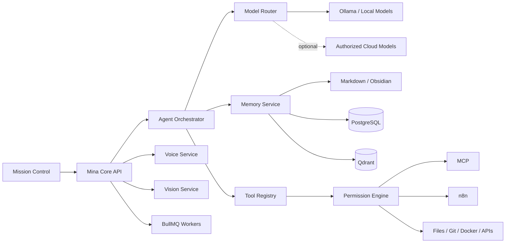

# Mina

### Local-First AI · RAG · Multi-Agent Systems · Automation

**Public engineering showcase — personal implementation remains private**

[Architecture](./docs/ARCHITECTURE.md) · [Project status](./docs/STATUS.md)

---

## Overview

**Mina** is a local-first intelligent personal assistant designed as a persistent cognitive system rather than a stateless chatbot.

The private system combines:

- a web Mission Control interface
- a Fastify core API
- multi-agent orchestration
- local and authorized-cloud model routing
- three-layer persistent memory
- local RAG
- permission-gated tools
- n8n automation
- MCP integrations
- local voice and vision services
- controlled autonomous workflows

The design principle is simple: **utility, memory and control come before visual polish**.

## Core Architecture

## What Is Implemented in the Private System

### Persistent Memory

Mina uses three complementary memory layers:

- Markdown/Obsidian for durable human-readable knowledge
- PostgreSQL for structured metadata and relationships
- Qdrant for semantic retrieval

The system can degrade to lighter local storage when infrastructure is unavailable.

### Retrieval-Augmented Generation

Memory can be reindexed and searched semantically. The architecture supports local embeddings through Ollama with deterministic fallback behavior.

### Multi-Agent Orchestration

A central orchestrator coordinates specialized agents for memory, projects, technical planning, research, vision and professional/industrial tasks.

The private roadmap records **14 implemented agents** in the core system.

### Tool & Permission Model

Tools are registered centrally and every action passes through a **Permission Engine** with explicit risk levels, approval queues, safe mode and emergency controls.

### Automation

n8n workflows are versioned and invoked through controlled tooling rather than giving agents unrestricted automation access.

### Voice & Vision

Dedicated local services support:

- speech-to-text
- text-to-speech
- OCR
- PDF extraction
- image description

The services are intentionally degradable when optional models/binaries are unavailable.

### Mission Control

The interface visualizes system state, memory, agents, tasks, evidence, automation and security controls.

## Verification Evidence

The private roadmap documents the base system (phases 0–13) as completed and verified with:

- clean typechecks across the packages
- **99 automated tests**
- live API validation
- local-first degradation paths

Later visual/interactivity phases add graph, agent-office, gesture, 3D/geo and briefing interfaces on top of that core.

## Technology

| Area | Technologies |
|---|---|
| Core | TypeScript · Fastify |
| UI | React · Vite · Three.js |
| Local AI | Ollama |
| Memory | Obsidian/Markdown · PostgreSQL · Qdrant |
| Retrieval | RAG · local embeddings |
| Queues | Redis · BullMQ |
| Automation | n8n |
| Tooling | MCP · Tool Registry |
| Security | Permission Engine · approvals · safe mode |
| Voice | Python · FastAPI · faster-whisper · Piper |
| Vision | Python · FastAPI · OCR/PDF tooling |
| Infrastructure | Docker |

## Engineering Decisions

**Local-first by default.** Internet is an enhancement, not a core dependency.

**Graceful degradation is part of the architecture.** Missing Ollama, Qdrant, PostgreSQL, n8n, voice or vision services should produce explicit reduced capability instead of silent failure.

**Tools are not equal to permissions.** Discovering a tool does not automatically authorize its execution.

**Memory is a system component, not chat history.** Structured, semantic and human-readable memory are kept distinct.

**Visual features sit on top of functional infrastructure.** The UI does not substitute for real data or services.

## Current Status

The core local-first architecture is substantially implemented and verified in the private project. Some real-infrastructure and external-account validations remain optional/environment-dependent.

[See the implementation matrix →](./docs/STATUS.md)

## Privacy

Mina contains personal memory, private automation rules, local paths, credentials and integration state. Publishing the implementation would defeat the privacy model the system is designed around.

---

### What this project demonstrates

**AI systems engineering · RAG · agent orchestration · local-first architecture · security controls · automation · multimodal services**
