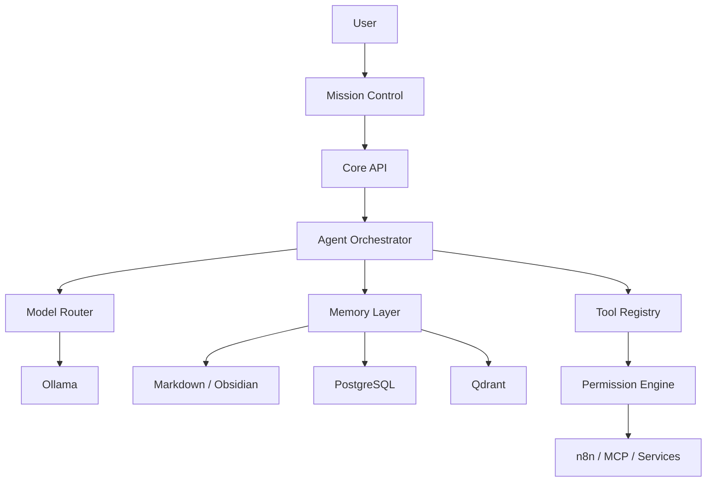

# Mina — Architecture Notes

## Core Components

### Mission Control
Visual interface for system status, memory, agents and actions.

### Core API
Central application boundary for requests and system coordination.

### Agent Orchestrator
Routes work to specialized agents and coordinates their outputs.

### Model Router
Selects local or authorized external models.

### Memory
Combines human-readable notes, structured relational data and semantic vector search.

### Tool Registry + Permission Engine
Separates tool discovery from authorization and execution.

## Logical Flow

## Design Considerations

- Local-first operation is preferred.
- Optional services degrade gracefully.
- Memory is persistent and auditable.
- Tool use is permission-gated.
- Personal data and private automation state remain outside this public repository.
